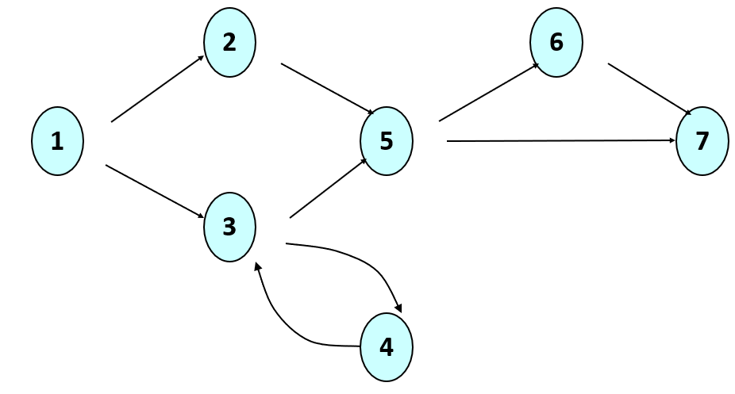

# Worksheet: J7

Worksheets are self-guided activities that reinforce lectures. They are not graded for accuracy, only for completion. Worksheets are due by Sunday night before the next lecture.

## Note

Attempt to answer these questions before running the code. This will improve your ability to analyize and reason about code without an IDE or compiler. This skill we be helpful on the exams.

This worksheet combines topics from the Software Testing lecture as well as today's lecture.

## Questions

### q

What is fault localization?


#### s
Fault localization typically involves tracing back from the line of code producing the incorrect output to where the problem actually was. To do this, a failing test case is needed, as well as the ability to trace through code, whether with print statements or a debugger.

### q

What are three benefits of Test Driven Development (TDD)?

#### s
* Your tests are not biased by your code
* Writing tests helps you think about how you might write code
* Writing tests helps you think about the requirements of your system

### q

Given the example of requirements for generating a password:

*    It must have at least one number.
*    It must have at least one uppercase letter.
*    It must have at least one lowercase letter.
*    It must not contain the website gmail anywhere. (For example if we were generating a password for gmail accounts)
*    It can only be made up of letters, numbers, and the underscore.

What are the input domain paritions for this exercise?

#### s

First, we have valid and invalid passwords:
* invalid
* valid

But each of these groups can be refined as:
* invalid
*   - missing uppercase letter
*   - missing lowercase letter
*   - missing number
*      - missing all combinations of the three items above
*   - contains `gmail`
*   - contains non-valid characters
* valid

Although the question did not ask for this, more tests could/should be generated by looking at the edge cases between these partitions.

### q

Complete the truth table below to show what inputs we need to achieve *active clause coverage* for the following conditional:

```java
if ( ( (a > b) or G ) and (x < y) )
```

| a > b | G | x < y | predicate outcome | clause responsible |

#### s

| a > b | G | x < y | predicate outcome | clause responsible |
|   T   | T |   T   | T                 | x < y              |
|   T   | T |   F   | F                 | x < y              |
|   F   | T |   T   | T                 | G                  |
|   F   | F |   T   | F                 | G                  |
|   T   | F |   T   | T                 | a > b              |
|   F   | F |   T   | F                 | a > b              |


### q

Consider the control flow graph below. What are all the paths (using node numbers) that would achieve full path coverage as a test criteria? Is this a finite set?



#### s

The set is infinite because of the loop between 3 and 4:

`
12567
1257
13567
1357
1343567
134357
13434567
1343457
134..567
134..67
`

### q

What benefit does *mutation testing* offer over other testing methods discussed in class?

#### s

Mutation testing is automated, in the sense that it solves the *oracle problem*: there is no need to define expected outputs, because we assume the current functionality of the program under test is correct (and therefore the correct output). Our goal is not to test the correctness of this code directly, but to test how complete/effective our test suite is. The assumption is that real bugs will be found in the code if we generate a robust enough test suite.

### q

Convert your `DriverJava1_sample.java` file from the previous lecture into a Junit test file with the following elements:

* a single unit test for every input class (give it the name of that input partition)
* a setup method that runs before each test that prints out `running setup`
* a teardown method for the entire test suite that prints out `finished all tests`

Assume that the method under test is called `checkCode` that takes a string as an argument and returns a boolean value whether or not the input was a valid code.

#### s

Answers will vary, but here is a template for your tests:

```java

import org.junit.Test;
import static org.junit.Assert.assertEquals;
import java.io.*;

public class UnitTestExample {

    @Before
    public void before() {
        System.out.println("running setup");
    }

    @AfterClass
    public void after() {
        System.out.println("finished all tests");
    }

    @Test
    public void valid_inputs() {
        assertEquals(true, checkCode("Hi9_jf5D3r"));
    }   

    // your other tests here
}
```
